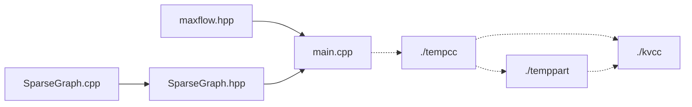

# k-VCC Finding System

## Overview

This is a replication of the paper ***Enumerating k-Vertex Connected Components in Large Graphs***

## Abstract (The abstract of the original paper)

Cohesive subgraph detection is an important graph problem that is widely applied in many application domains, such as social community detection, network visualization, and network topology analysis. Most of existing cohesive subgraph metrics can guarantee good structural properties but may cause the free-rider effect. Here, by free-rider effect, we mean that some irrelevant subgraphs are combined as one subgraph if they only share a small number of vertices and edges. In this paper, we study k-vertex connected component (k-VCC) which can effectively eliminate the free-rider effect but less studied in the literature. A k-VCC is a connected subgraph in which the removal of any k − 1 vertices will not disconnect the subgraph. In addition to eliminating the free-rider effect,k-VCC also has other advantages such as bounded diameter, high cohesiveness, bounded graph overlapping, and bounded subgraph number. We propose a polynomial time algorithm to enumerate allk-VCCs of a graph by recursively partitioning the graph into overlapped subgraphs. We find that the key to improving the algorithm is reducing the number of local connectivity testings. Therefore, we propose two effective optimization strategies, namely neighbor sweep and group sweep, to largely reduce the number of local connectivity testings. We conduct extensive performance studies using seven large real datasets to demonstrate the effectiveness of this model as well as the efficiency of our proposed algorithms.

## Algorithm Outline


## Implementation details

For large-scale graph data, Python or C++ can be considered for processing. Since Python has high integration, it is not convenient to modify the underlying logic. Additionally, in terms of speed, Python is much slower than C++. So I use C++ to implement it.

After deciding to use C++, I first attempted to write some code, but soon encountered a major problem: **insufficient stack space**. Due to the large size of the data and the involvement of subgraph decomposition and recursion, it seems impossible to allocate the graph in our memory.

To solve this problem, I rewrite the function into a non-recursive form and **write them into files**. Writing the decomposed graphs to a temporary folder, ensure that only a small number of graphs were in memory at a time. After the use, they are deleted, and the decomposed subgraphs were read from the new function. Of course, this inevitably leads to **disk I/O overhead**. However, when dealing with large-scale data, we inevitably encounter problems where the data size is too large to fit in memory. In that case, this approach becomes a **more generalizable method**.

Furthermore, since the implementation mentioned in the paper is for unweighted undirected graphs, I initially developed an optimized version specifically for unweighted undirected graphs. However, later on, during the computation of the min-cut, it turned out that the flow information needed to be added to the edges (although it was only 1 or infinity). Consequently, I had to write a separate file to implement the maximum flow algorithm (which also required modifications in the graph construction), along with the corresponding minimum cut.

## Structure

The relationship between the files looks like this:



## Quick Use

I wrote a make file below, you just need to change the dataset $filename$ and the $k$, then just `make` and run using `make run`

```makefile
filename = MiniDataSet
k = 4

all: main
	@echo All programs compiled.

main: main.cpp SparseGraph.cpp
	@echo Compiling main module...
	@g++ -o main -O2 main.cpp SparseGraph.cpp
	@echo Finished.

.PHONY: run clean cleandata

run:
	./main "./$(filename).txt" $(k)

clean:
	rm -f main
	mkdir -p tempcc && rm -f tempcc/*.txt
	mkdir -p kvcc && rm -f kvcc/*.txt
	mkdir -p temppart && rm -f temppart/*.txt

cleandata:
	mkdir -p tempcc && rm -f tempcc/*.txt
	mkdir -p kvcc && rm -f kvcc/*.txt
	mkdir -p temppart && rm -f temppart/*.txt

```

Note: Don't forget to change the dataset location into your owns.

As for the file format, the first line is the metadata about the graph: the $maxnodeid+1$ and the $edgenumber$, which is followed by $edgenumber$ pairs of nodes which means an edge.

