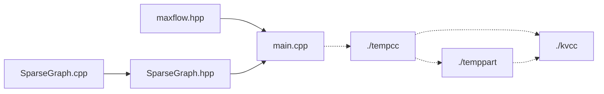

# k-VCC Finding System

## Overview

For large-scale graph data, Python or C++ can be considered for processing. Since Python has high integration, it is not convenient to modify the underlying logic. Additionally, in terms of speed, Python is much slower than C++. So I use C++ to implement it.

After deciding to use C++, I first attempted to write some code, but soon encountered a major problem: **insufficient stack space**. Due to the large size of the data and the involvement of subgraph decomposition and recursion, it seems impossible to allocate the graph in our memory.

To solve this problem, I rewrite the function into a non-recursive form and **write them into files**. Writing the decomposed graphs to a temporary folder, ensure that only a small number of graphs were in memory at a time. After the use, they are deleted, and the decomposed subgraphs were read from the new function. Of course, this inevitably leads to **disk I/O overhead**. However, when dealing with large-scale data, we inevitably encounter problems where the data size is too large to fit in memory. In that case, this approach becomes a **more generalizable method**.

Furthermore, since the implementation mentioned in the paper is for unweighted undirected graphs, I initially developed an optimized version specifically for unweighted undirected graphs. However, later on, during the computation of the min-cut, it turned out that the flow information needed to be added to the edges (although it was only 1 or infinity). Consequently, I had to write a separate file to implement the maximum flow algorithm (which also required modifications in the graph construction), along with the corresponding minimum cut.

## Structure

The relationship between the files looks like this:



## Quick Use

I wrote a make file below, you just need to change the dataset $filename$ and the $k$, then just `make` and run using `make run`

```makefile
filename = MiniDataSet
k = 4

all: main
	@echo All programs compiled.

main: main.cpp SparseGraph.cpp
	@echo Compiling main module...
	@g++ -o main -O2 main.cpp SparseGraph.cpp
	@echo Finished.

.PHONY: run clean cleandata

run:
	./main "./$(filename).txt" $(k)

clean:
	rm -f main
	mkdir -p tempcc && rm -f tempcc/*.txt
	mkdir -p kvcc && rm -f kvcc/*.txt
	mkdir -p temppart && rm -f temppart/*.txt

cleandata:
	mkdir -p tempcc && rm -f tempcc/*.txt
	mkdir -p kvcc && rm -f kvcc/*.txt
	mkdir -p temppart && rm -f temppart/*.txt

```

Note: Don't forget to change the dataset location into your owns.

As for the file format, the first line is the metadata about the graph: the $maxnodeid+1$ and the $edgenumber$, which is followed by $edgenumber$ pairs of nodes which means an edge.

